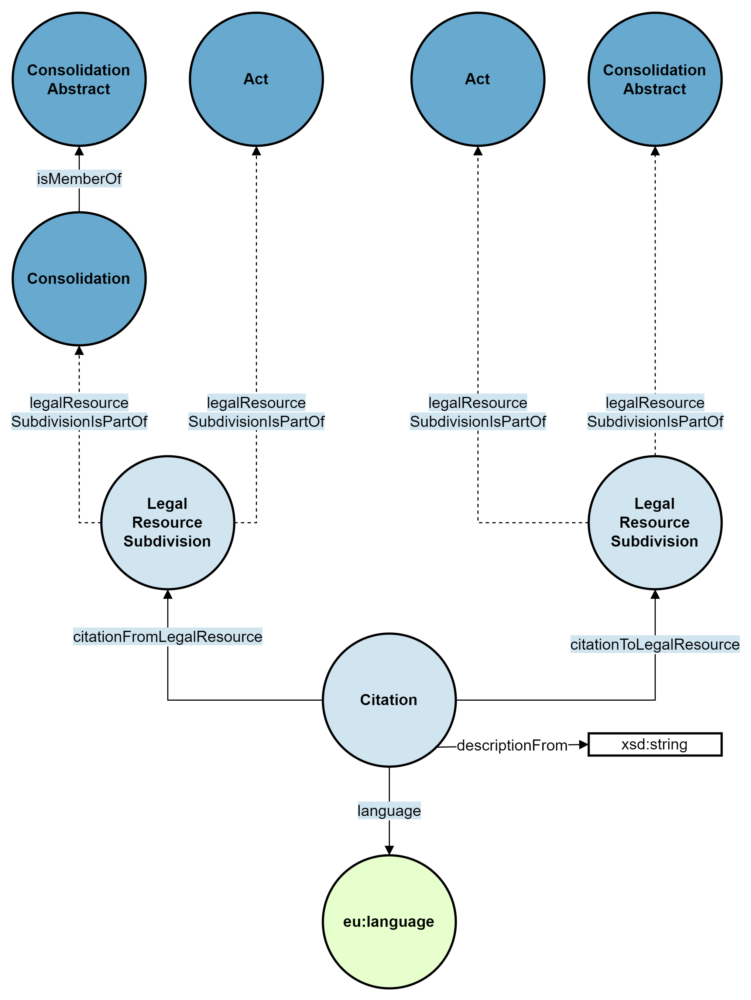

# Citations

Legal texts often refer other legislative resources in the form of citations. In JOLux, citations are modelled as [jolux:Citation](#Citation).

:::{admonition} jolux:Citation
:class: note
:name: Citation
A **jolux:Citation** is used to model citations between legislative resources.
:::

The following figure shows the general structure of a citation:

:::{figure-md} citation_fig



General structure of a citation.
:::

## From and To

A citation *from* means the citing resource whereas *to* means the cited resource. So if a legislative resource cites the Federal Constitution, the citation goes *from* this resource *to* the Federal Constitution.

:::{admonition} jolux:citationFromLegalResource
:class: note
:name: citationFromLegalResource
The object property **jolux:citationFromLegalResource** is used to connect a [jolux:Citation](#Citation) to a [jolux:LegalResourceSubdivision](#LegalResourceSubdivision) that is the **citing** document.
:::

:::{admonition} jolux:citationToLegalResource
:class: note
:name: citationToLegalResource
The object property **jolux:citationToLegalResource** is used to connect a [jolux:Citation](#Citation) to a [jolux:LegalResourceSubdivision](#LegalResourceSubdivision) that is the **cited** document.
:::

## SPARQL Example

The following SPARQL query shows all the [jolux:ConsolidationAbstract](#ConsolidationAbstract) with its German titles that cite the Federal Constitution:

```sparql
PREFIX jolux: <http://data.legilux.public.lu/resource/ontology/jolux#>
SELECT * WHERE {
	?citation jolux:citationToLegalResource/jolux:legalResourceSubdivisionIsPartOf <https://fedlex.data.admin.ch/eli/cc/1999/404>;
                                        jolux:citationFromLegalResource/jolux:legalResourceSubdivisionIsPartOf/jolux:isMemberOf ?consolidationAbstractFrom.
  ?citation jolux:descriptionFrom ?descriptionFrom;
            jolux:language <http://publications.europa.eu/resource/authority/language/DEU>.
  ?consolidationAbstractFrom jolux:isRealizedBy ?expressionFrom.
  ?expressionFrom jolux:language <http://publications.europa.eu/resource/authority/language/DEU>;
              jolux:title ?titleFrom.
}
```
