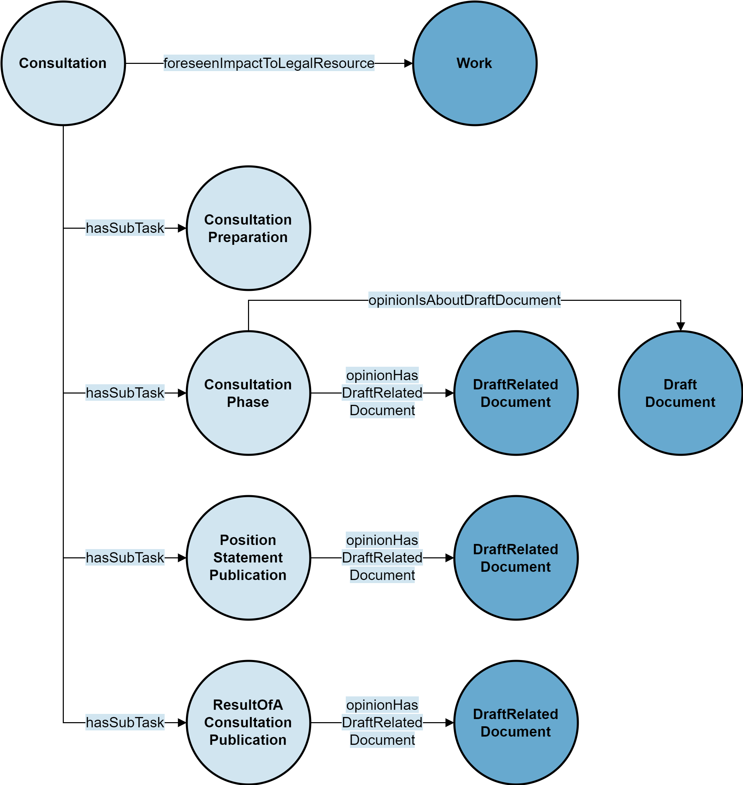

# Consultations

:::{admonition} Under construction
:class: danger
This sub-page is under construction...
:::

A *consultation* is the process of asking for feedback on a draft of a legislative resource.

## Example

Throughout this sub-page, the following consultation with a possible impact on the federal constitution is used as an example:

- URI: https://fedlex.data.admin.ch/eli/dl/proj/2022/59/cons_1
- URL: https://www.fedlex.admin.ch/de/consultation-procedures/ended/2022#https://fedlex.data.admin.ch/eli/dl/proj/2022/59/cons_1
- [Metadata viewer](https://fedlex.data.admin.ch/de-CH/metadata?value=https:%2F%2Ffedlex.data.admin.ch%2Feli%2Fdl%2Fproj%2F2022%2F59%2Fcons_1)

## URI

The URI of a consultation contains the following parts:

- Standard namespace and path: `https://fedlex.data.admin.ch/eli/`
- the part `dl/proj` is used as path for all consultations
- `YYYY/` is the year of the consultation
- `ID` an identifier that has no specific meaning but restarts every year
- `cons_1` is used for every consultation

## General Structure

Every consultation is of type jolux:Consultation.

:::{admonition} jolux:Consultation
:class: note
:name: Consultation
The owl:Class **jolux:Consultation** is used for consultations.
:::

A jolux:Consultation has a foreseen impact to a legislative resource. This is given by jolux:foreseenImpactToLegalResource:

:::{admonition} jolux:foreseenImpactToLegalResource
:class: note
:name: foreseenImpactToLegalResource
The object property **jolux:foreseenImpactToLegalResource** is used to connect a [jolux:Consultation](#Consultation) to a [jolux:Work](#Work) (usually a [jolux:ConsolidationAbstract](#ConsolidationAbstract)).
:::

The jolux:Consultation is structured into different jolux:ConsultationTask that are connected to the jolux:Consultation with the object property jolux:hasSubTask:

:::{admonition} jolux:ConsultationTask
:class: note
:name: ConsultationTask
The owl:Class **jolux:ConsultationTask** is used for the different tasks of a jolux:Consultation.
:::

:::{admonition} jolux:hasSubTask
:class: note
:name: hasSubTask
The object property **jolux:hasSubTask** is used to connect a [jolux:Consultation](#Consultation) to a [jolux:ConsultationTask](#ConsultationTask).
:::

There are four types of jolux:ConsultationTask:

- jolux:ConsultationPreparation
- jolux:ConsultationPhase
- jolux:PositionStatementPublication
- jolux:ResultOfAConsultationPublication

The following figure shows the general structure of a consultation:

:::{figure-md} consultation

General structure of a consultation.
:::
