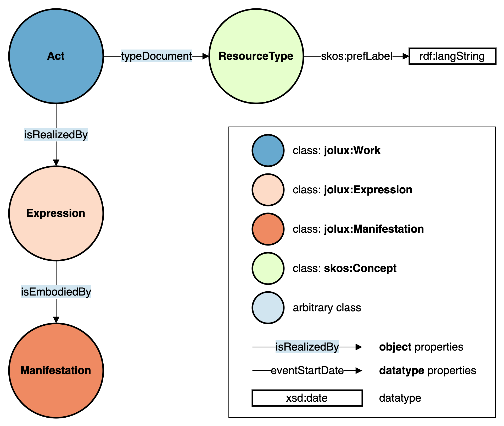

:::{toctree}
:maxdepth: 2
:caption: Content
:hidden:

Introduction <self>
abstraction_levels.md
official_compilation.md
classified_compilation.md
impacts.md
subdivisions.md
chronology.md
changes.md
citations.md
vocabularies.md
dates.md
reference.md
:::

# Introduction

This introduction explains some key terms to understand the scope of its content and describes the structure of the webpage and how to use it.

## Fedlex

The Swiss federal government operates the **Fedlex** platform to publish the **federal law**. This platform provides a [website](https://www.fedlex.admin.ch/en) as frontend with easy navigable functions. For some cases, it is beneficial to work directly with the raw data that is also the basis for the frontend website. This raw data is available in [RDF](https://www.w3.org/TR/rdf11-primer/) format through a [SPARQL GUI](https://fedlex.data.admin.ch/en-CH/sparql) and a SPARQL endpoint at `https://fedlex.data.admin.ch/sparqlendpoint`.

## JOLux Ontology

The raw data of the Fedlex platform in RDF is modelled according to the **JOLux ontology**. This ontology is used for describing **legislative resources and their relationships**.

JOLux is based on recent developments in bibliographical description, adapting the [FRBR model](https://repository.ifla.org/handle/123456789/811) (Functional requirements for Bibliographic Records, developed by the [IFLA](https://www.ifla.org/)) in order to describe legislative resources.

This website's goal is to document the JOLux ontology and help users to find their way into the RDF data of the Fedlex platform and make the most use of it. It is not the basis for the JOLux ontology meaning that there is no completeness of all the aspects of JOLux in this documentation. So this website can not be used to model data according to the JOLux ontology but rather to understand data that is already modelled with help of JOLux. If complete insight into the JOLux ontology is necessary, it can be [downloaded](https://fedlex.data.admin.ch/filestore/resources/jolux_ontology.zip) as Turtle file for further investigation.

## How to Use this Website

This website has sub-pages for all the important [concepts](reference.md#concepts). A concept is loosely defined an important element of the JOLux ontology. These sub-pages describe the concept in prose. Additional call-out boxes give short definition of JOLux and other terms (see the example below for [ontology](#Ontology)). These boxes are all linked in the [reference](reference.md).

:::{admonition} Ontology
:class: note
:name: Ontology
An ontology is a set of precise descriptive statements about some part of the world (usually referred to as the domain of interest or the subject matter of the ontology). Precise descriptions satisfy several purposes: most notably, they prevent misunderstandings in human communication and they ensure that software behaves in a uniform, predictable way and works well with other software. [Source](https://www.w3.org/TR/owl2-primer/)
:::

The visual representation of parts of the JOLux ontology on this website is loosely based on the [VOWL](https://service.tib.eu/webvowl/) project. In addition, multiple colors represent the different [abstraction levels](abstraction_levels.md) of JOLux.

The following figure shows the elements of graphical representation of JOLux in this documentation using an example of a [jolux:Act](#Act):

:::{figure-md} ontology_elements



Graphical representation of JOLux ontology elements.
:::

The figure above can be read as: Some object of type [jolux:Act](#Act) is connected to an object of type [jolux:Expression](#Expression) via predicate [jolux:isRealizedBy](#isRealizedBy). So the single bubbles do not represent concrete objects but signal class memberships.

## SPARQL Queries

Throughout this webpage, there are examples of SPARQL queries given. The idea is, that these are real queries that can be executed on the [Fedlex SPARQL GUI](https://fedlex.data.admin.ch/en-CH/sparql) to get real up to date results. To do so, below every SPARQL example query, there is a "Execute Query" button that transfers the corresponding query into the SPARQL GUI and executes it to show the tabular result. As the source code of these queries is also given, the user should be encouraged to modify these queries directly in the SPARQL GUI or use it programmatically to their own needs.

The following SPARQL query shows this method by giving the 10 newest published [jolux:Act](#Act) that are available:

```sparql
PREFIX jolux: <http://data.legilux.public.lu/resource/ontology/jolux#>
SELECT * WHERE {
    ?act a jolux:Act;
         jolux:publicationDate ?date.
} ORDER BY DESC(?date)
LIMIT 10
```

## Fedlex URI and URL

All URI of Fedlex raw data resources start with: `https://fedlex.data.admin.ch/eli` whereas `eli` is an abbreviation for [European Legislation Identifier](https://eur-lex.europa.eu/content/help/eurlex-content/eli.html).

These URI can be found on the website of [Fedlex](https://www.fedlex.admin.ch/) through a search. The raw data URI is not the URL shown in the browser address field but can be copied by clicking on the chain icon. If an an URI is put into the browser address field, there is an automatic redirection to the webpage URL that displays the corresponding resource.

Examples for the federal constitution in the Classified Compilation:

- URI: https://fedlex.data.admin.ch/eli/cc/1999/404
- URL: https://www.fedlex.admin.ch/eli/cc/1999/404

The easiest way to have a graph like representation of a Fedlex URI (and not a redirection to the URL) is to put it into the [metadata viewer](https://fedlex.data.admin.ch/en-CH/metadata) of the Fedlex platform. Links to the metadata viewer with prefilled URI can also be programmatically created via URL parameter `value` with the desired URI:

`https://fedlex.data.admin.ch/en-CH/metadata?value=https://fedlex.data.admin.ch/eli/cc/1999/404`

## Namespaces Declarations

The following namespaces are used throughout this documentation:

| PREFIX | URI |
| :--- | :--- |
| jolux | http://data.legilux.public.lu/resource/ontology/jolux# |
| schema | http://schema.org/ |
| skos | http://www.w3.org/2004/02/skos/core# |
| dcterm | http://purl.org/dc/terms/ |
| xsd | http://www.w3.org/2001/XMLSchema# |
| rdfs | http://www.w3.org/2000/01/rdf-schema# |
| rdf | http://www.w3.org/1999/02/22-rdf-syntax-ns# |
| owl | http://www.w3.org/2002/07/owl# |
| eu | http://publications.europa.eu/resource/authority/ |
